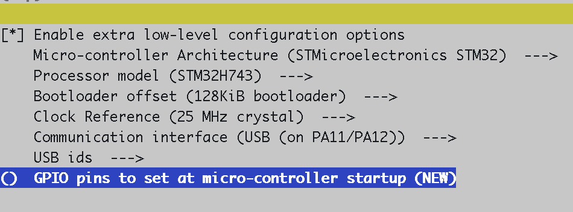
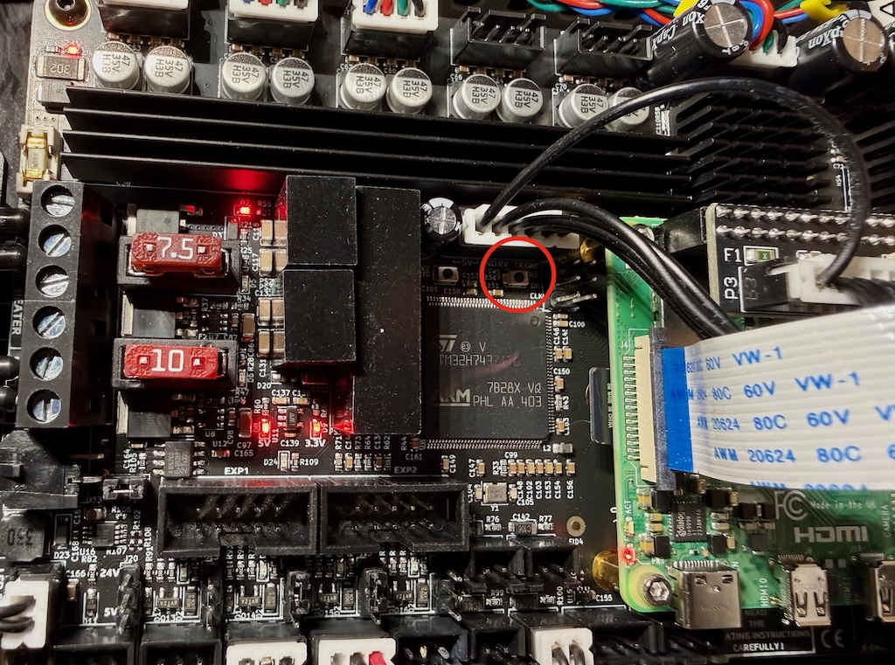
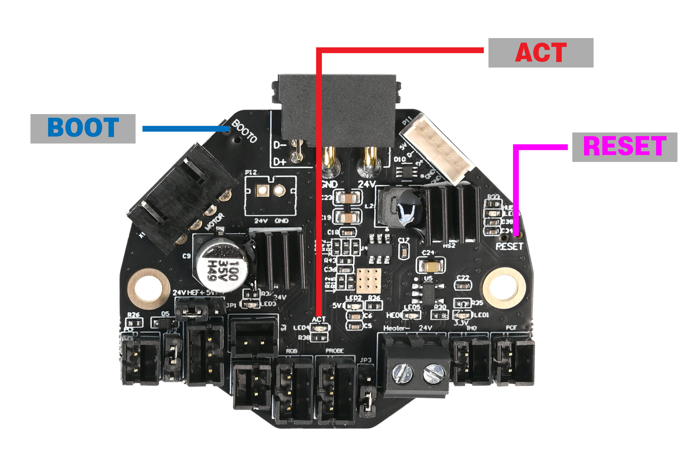
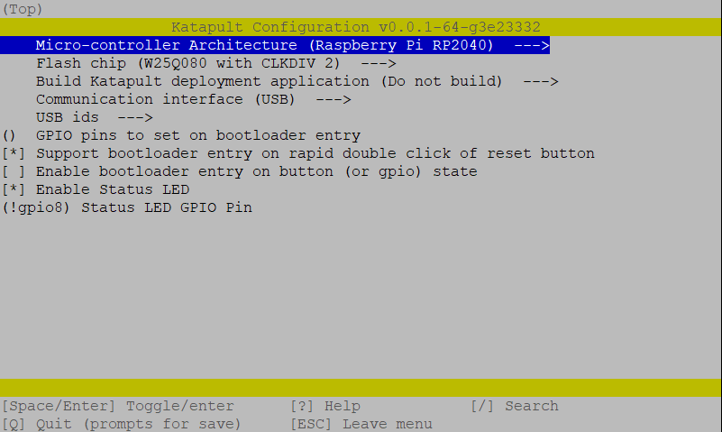
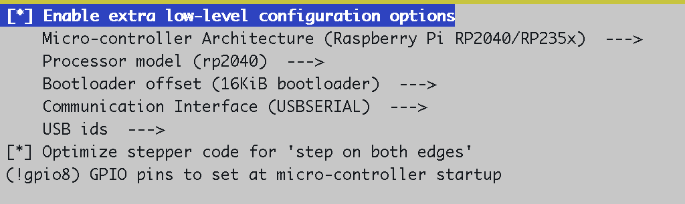
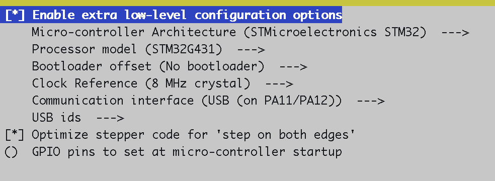

# Flashing MCU Firmware

All boards use [Katapult](https://github.com/Arksine/katapult) as the bootloader, except the KUSBA-Pro which uses DFU directly. Katapult lets you reflash Klipper over USB without physical button presses after the initial bootloader install.

---

## Leviathan (STM32H743)

Reference: [LDO Leviathan guide](https://ldomotion.com/guides/voron-leviathan-v1-3#section-2)

### Flash Katapult (bootloader, first time only)

```bash
cd ~/katapult
make menuconfig
```

| Setting | Value |
|---|---|
| Microcontroller Architecture | STMicroelectronics STM32 |
| Processor model | STM32H743 |
| Clock Reference | 25 MHz crystal |
| Communication interface | USB (on PA11/PA12) |
| Application start offset | 128KiB offset |
| Support bootloader entry on rapid double click of reset button | ✓ |
| Enable Status LED | ✓ |
| Status LED GPIO Pin | PE1 |

```bash
make
```

!!! warn
    Incomplete - flash per the LDO guide linked above

### Build Klipper

```bash
cd ~/klipper
make clean && make menuconfig
```

| Setting | Value |
|---|---|
| Enable extra low-level configuration options | ✓ |
| Micro-controller Architecture | STMicroelectronics STM32 |
| Processor model | STM32H743 |
| Bootloader offset | 128KiB bootloader |
| Clock Reference | 25 MHz crystal |
| Communication interface | USB (on PA11/PA12) |
| GPIO pins to set at micro-controller startup | () |



```bash
make
```

### Flash Klipper via Katapult



- With a non-metal tool, double-click the reset button to enter the Katapult bootloader.
- You will notice the board re-enumerates in the serial device listings and changes name from `usb-Klipper_stm32h743xx-...` to `usb-katapult_stm32h743xx-...`:

  ```
  # before:
  printer@trident:~ $ ll /dev/serial/by-id
  ...
  lrwxrwxrwx 1 root root 13 Apr 27 11:10 usb-Klipper_stm32h743xx_24002A000351323439333335-if00 -> ../../ttyACM0
  ...

  # after:
  lrwxrwxrwx 1 root root 13 Apr 27 11:17 usb-katapult_stm32h743xx_24002A000351323439333335-if00 -> ../../ttyACM3
  ```

!!! warn
    Replace the device ID with your own device name

- Flash the MCU:

  ```bash
  ~/katapult-env/bin/python3 ~/katapult/scripts/flashtool.py \
    -f out/klipper.bin \
    -d /dev/serial/by-id/usb-katapult_stm32h743xx_24002A000351323439333335-if00
  ```

- After a successful flash, the board will re-enumerate abck to its original name `usb-Klipper_stm32h743xx-...`

**Example output of successful flash**

```shell
Connecting to Serial Device /dev/serial/by-id/usb-katapult_stm32h743xx_24002A000351323439333335-if00, baud 250000
Detected USB device running Katapult
Detected Klipper binary version v0.13.0-629-g6349d4fb, MCU: stm32h743xx
Attempting to connect to bootloader
Katapult Connected
Software Version: v0.0.1-106-g399e50e
Protocol Version: 1.1.0
Block Size: 64 bytes
Application Start: 0x8020000
MCU type: stm32h743xx
Flashing '/home/printer/klipper/out/klipper.bin'...

[##################################################]

Write complete: 1 pages
Verifying (block count = 680)...

[##################################################]

Verification Complete: SHA = 0E88C177815F6CE9B43D0CF694A882F21E3B4C33
Programming Complete
```

---

## Nitehawk-36 (RP2040)



### Install Katapult (bootloader, first time only)

- Enter USB boot mode: hold **RESET + BOOT0**, release RESET, then release BOOT0. The board mounts as a mass storage device:

  ```shell
  printer@trident:~/klipper $ ls -la /dev/sda*
  brw-rw---- 1 root disk 8, 0 Apr 27 11:37 /dev/sda
  brw-rw---- 1 root disk 8, 1 Apr 27 11:37 /dev/sda1
  ```

- Build Katapult for NHK-36

  ```shell
  cd ~/katapult
  make clean && make menuconfig
  ```



- Build and copy the bootloader

  ```shell
  make
  sudo mkdir -p /mnt/pico
  sudo mount /dev/sda1 /mnt/pico
  sudo cp ~/katapult/out/katapult.uf2 /mnt/pico
  sudo sync
  sudo umount /mnt/pico
  ```

### Build Klipper

```bash
cd ~/klipper
make clean && make menuconfig
```

| Setting | Value |
|---|---|
| Enable extra low-level configuration options | ✓ |
| Micro-controller Architecture | Raspberry Pi RP2040/RP235x |
| Processor model | rp2040 |
| Bootloader offset | 16KiB bootloader |
| Communication Interface | USBSERIAL |
| Optimize stepper code for 'step on both edges' | ✓ |
| GPIO pins to set at micro-controller startup | !gpio8 |



```bash
make
sudo systemctl stop klipper
```

### Flash Klipper via Katapult

- Double-click the RESET button — the ACT light will blink slowly. The board re-enumerates as `usb-katapult_rp2040_...`:

```
printer@trident:~/klipper $ ll /dev/serial/by-id
...
lrwxrwxrwx 1 root root 13 Apr 27 11:40 usb-katapult_rp2040_3232323236195875-if00 -> ../../ttyACM2
...
```

- Flash the MCU (replace the device name with yours)

```bash
~/katapult-env/bin/python3 ~/katapult/scripts/flashtool.py \
  -f out/klipper.bin \
  -d /dev/serial/by-id/usb-katapult_rp2040_3232323236195875-if00
```

**Example output of successful flash**

```shell
Connecting to Serial Device /dev/serial/by-id/usb-katapult_rp2040_3232323236195875-if00, baud 250000
Detected USB device running Katapult
Detected Klipper binary version v0.13.0-629-g6349d4fb, MCU: rp2040
Attempting to connect to bootloader
Katapult Connected
Software Version: v0.0.1-75-g90eb71b
Protocol Version: 1.1.0
Block Size: 64 bytes
Application Start: 0x10004000
MCU type: rp2040
Flashing '/home/printer/klipper/out/klipper.bin'...

[##################################################]

Write complete: 167 pages
Verifying (block count = 668)...

[##################################################]

Verification Complete: SHA = 7DF6A0118E82092E6A40D567188FA3654F2BC1ED
Programming Complete
```

- After a successful flash, the board will re-enumerate abck to its original name `usb-Klipper_rp2040-...`

---

## KUSBA-Pro v2.0 (STM32G431 via DFU)

Source: [KUSBA-PRO firmware docs](https://github.com/xbst/KUSBA-PRO/blob/master/Docs/Firmware-v2.md)

### Enter DFU mode

Hold the button on the KUSBA, plug it into USB, then release. Confirm it appeared in DFU mode — it won't show up in `/dev/serial/by-id`, but `lsusb` will show it:

```
printer@trident:~/klipper $ lsusb
...
Bus 001 Device 010: ID 0483:df11 STMicroelectronics STM Device in DFU Mode   <---------- this one
...
```

### Flash Klipper

```bash
cd ~/klipper
make clean && make menuconfig
```

| Setting | Value |
|---|---|
| Enable extra low-level configuration options | ✓ |
| Micro-controller Architecture | STMicroelectronics STM32 |
| Processor model | STM32G431 |
| Bootloader offset | No bootloader |
| Clock Reference | 8 MHz crystal |
| Communication interface | USB (on PA11/PA12) |
| Optimize stepper code for 'step on both edges' | ✓ |
| GPIO pins to set at micro-controller startup | () |



```bash
make
make flash FLASH_DEVICE=0483:df11
```

!!! note
    `dfu-util` prints `Error during download get_status` and exits non-zero — this is a known false error. The flash completes successfully before that point; ignore it.

Confirm the board came back up:

```
printer@trident:~/klipper $ ll /dev/serial/by-id
...
lrwxrwxrwx 1 root root 13 Apr 27 11:53 usb-Klipper_stm32g431xx_52003B0017504E5238363920-if00 -> ../../ttyACM3
```
