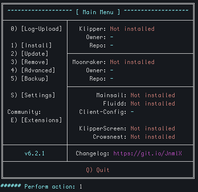
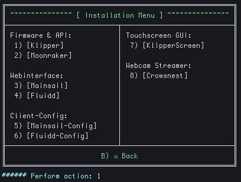
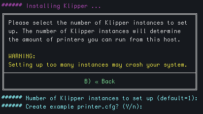
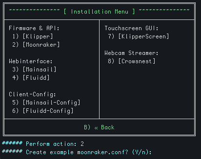
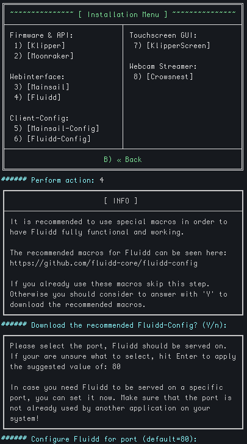
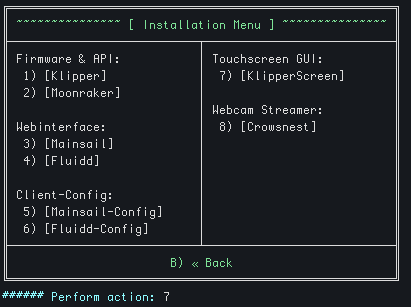
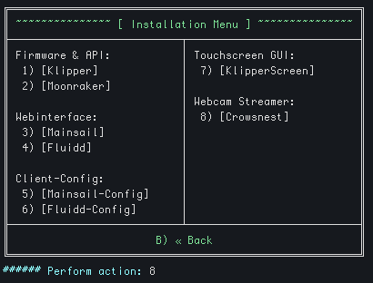

# Installing Klipper (KIAUH)

[KIAUH](https://github.com/dw-0/kiauh) (Klipper Installation And Update Helper) is the recommended way to install and manage the Klipper ecosystem on a Raspberry Pi.

## Prerequisites

- Finished Raspberry Pi OS install
- Packages updated to the latest (`apt update && apt full-upgrade`)
- `git` installed (`sudo apt install git`)

!!! note
    Raspberry Pi Zero 2 W (with headers) is recommended minimum for installs without crowsnest.</br>
    Raspberry Pi 4 1GB ($35) appears to be the sweet spot for price/performance balance.

## Install core components

### 1. Launch KIAUH

```shell
git clone https://github.com/dw-0/kiauh.git
./kiauh/kiauh.sh
```

You'll be greeted by the main menu showing the current installation status of all components:



### 2. Open the Installation Menu

Press `1` to enter the **Install** menu:



Install the following components in order:

---

#### Klipper (option 1)

The core firmware interface. When prompted, accept the default of **1 instance** unless you're running multiple printers from the same Pi.



---

#### Moonraker (option 2)

The API server that connects Klipper to web interfaces and companion apps. Accept the prompt to create an example `moonraker.conf`.



---

#### Fluidd (option 4)

The web UI for Klipper. KIAUH will prompt you to also download **Fluidd-Config** (recommended macros) and set a port — the default port `80` is fine for most setups.



---

#### KlipperScreen (option 7)

Touchscreen UI for DSI/HDMI displays connected directly to the Pi.



---

#### Crowsnest (option 8)

Webcam streaming service. Replaces the older `mjpg-streamer` setup.



---

## Install additional plugins

### Beacon eddy-current probe

```shell
cd ~
git clone https://github.com/beacon3d/beacon_klipper.git
./beacon_klipper/install.sh
```

### Katapult (bootloader flasher)

Required for flashing MCU firmware over USB/CAN without manually entering DFU mode.
See [Katapult docs](https://github.com/Arksine/katapult) for full usage.

```shell
git clone https://github.com/Arksine/katapult
virtualenv -p python3 ~/katapult-env
~/katapult-env/bin/pip3 install pyserial greenlet cffi python-can aenum
```

### Klippain Shake&Tune

Resonance measurement and analysis toolset for input shaper tuning.

```shell
wget -O - https://raw.githubusercontent.com/Frix-x/klippain-shaketune/main/install.sh | bash
```

### klipper_tmc_autotune

Automatic TMC stepper driver tuning based on motor parameters.

```shell
wget -O - https://raw.githubusercontent.com/andrewmcgr/klipper_tmc_autotune/main/install.sh | bash
```

### klipper-led_effect

Animated LED effects for NeoPixel/SK6812 strips.

```shell
cd ~
git clone https://github.com/julianschill/klipper-led_effect.git
cd klipper-led_effect && ./install-led_effect.sh
```

### Mobileraker Companion

Backend service required for push notifications in the [Mobileraker](https://github.com/Clon1998/mobileraker) Android/iOS app.

```shell
cd ~/
git clone https://github.com/Clon1998/mobileraker_companion.git
./mobileraker_companion/scripts/install.sh
```

### Nevermore Controller

Klipper module for the Nevermore activated carbon air filter.

```shell
cd ~
git clone https://github.com/SanaaHamel/nevermore-controller
cd nevermore-controller && ./install-klipper-module.bash
```

### Sonar (keepalive)

Prevents the Moonraker connection from dropping during long prints.

```shell
git clone https://github.com/mainsail-crew/sonar.git
cd ~/sonar
make config
sudo make install
```
